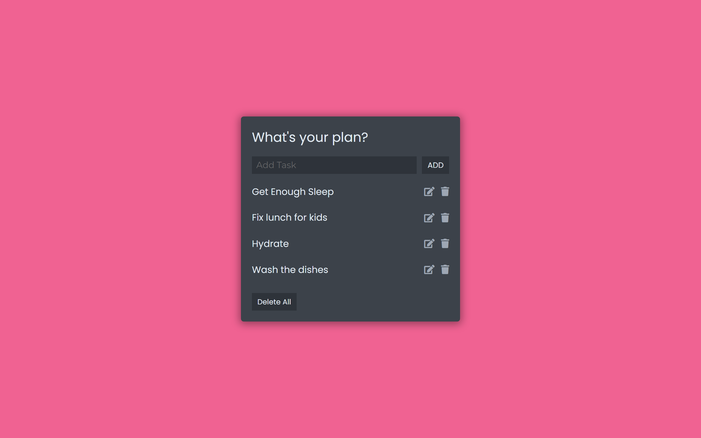

# Todo List app

## Table of contents

- [Overview](#overview)
  - [The challenge](#the-challenge)
  - [Screenshot](#screenshot)
  - [Links](#links)
- [My process](#my-process)
  - [Built with](#built-with)
  - [What I learned](#what-i-learned)
- [Author](#author)

## Overview

### The challenge

Users should be able to:

- Create, Edit and Delete a ToDo List
- Save a ToDo List using Local Storage

### Screenshot

### Links

- Live Site URL: [Todo List app](https://shaina1999.github.io/todo-list-app/)

## My process

### Built with

- Semantic HTML5 markup
- CSS custom properties
- Flexbox
- Desktop-first workflow
- [SASS](https://sass-lang.com/) - For CSS preprocessor
- Vanilla JavaScript

### What I learned

After developing this project, i learned how to convert an array into a string and save it on local storage. I also learned how to retrieve data from the local storage by parsing it and turning it back in a form of array. One thing that i solve on my own in this project is the update functionality.

## Author

- Website - [Shaina De Guzman](https://shainadeguzman.netlify.app/)

Thanks for checking out this project.
